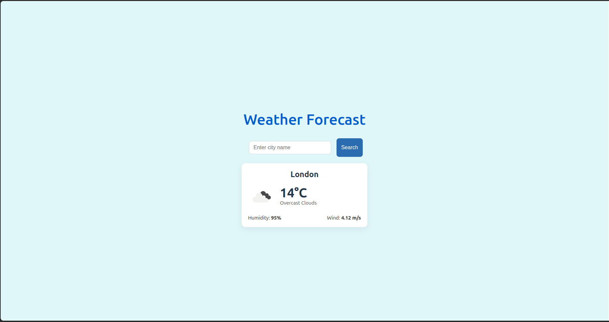
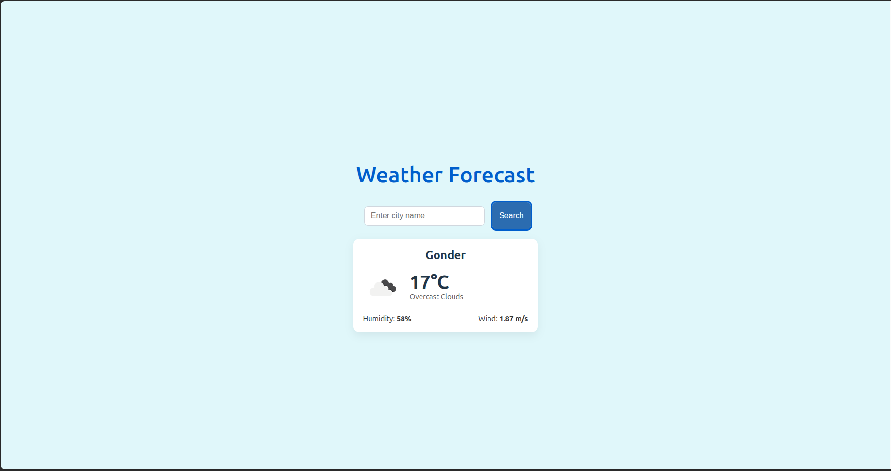
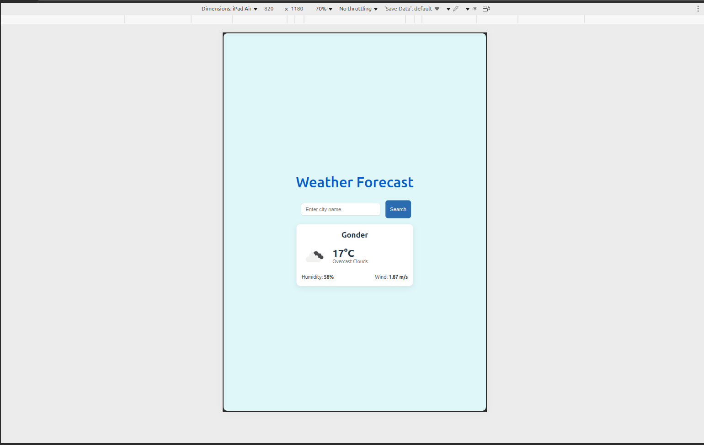

# WeatherSphere 🌤️

A modern, responsive weather application built with React + Vite. Features real-time weather data, an intuitive UI, and a seamless user experience.

🚀 Live Demo: https://weather-olive-two-20.vercel.app/
---

✨ Features

- 🔍 City Search — Find weather for any city worldwide
- 📱 Fully Responsive — Optimized for desktop, tablet, and mobile
- 🎨 Modern UI — Clean, professional design with smooth animations
- ⚡ Fast Performance — Built with Vite for optimal loading speeds
- 🌡️ Detailed Metrics — Temperature, humidity, wind speed, and conditions
- 🖼️ Dynamic Icons — Real weather icons from OpenWeatherMap
- 🛡️ Error Handling — Graceful error states and loading indicators

---

## Quick start

Prerequisites

- Node.js 16+
- OpenWeatherMap API key

Installation

1. Clone the repository and change to the project folder:

```bash
git clone <repo-url>
cd my-weather-app
```

2. Install dependencies:

```bash
npm install
```

3. Configure environment variables

Create a `.env` file in the project root (or copy the example if provided):

```bash
# If an example exists
cp .env.example .env || true

# Then edit `.env` and add your key
# .env
VITE_API_KEY=your_actual_api_key_here
```

4. Start the development server:

```bash
npm run dev
```

Open http://localhost:5173 to view the app.

---

## Application Preview

Main features (centered gallery):

<div align="center">
  <!-- Row 1 -->
  
  
  
</div>

Additional screenshots:

<div align="center" style="display:flex;flex-wrap:wrap;gap:10px;justify-content:center;">
  
  
  
</div>

---

## Build & Deployment

Development

```bash
npm run dev
```

Production build

```bash
npm run build
```

Preview production

```bash
npm run preview
```

Lint

```bash
npm run lint
```

---

## Project Architecture

```
src/
├── components/          # Reusable UI components
│   ├── SearchInput/     # City search functionality
│   └── WeatherDisplay/  # Weather data presentation
├── pages/
│   └── home/            # Main application page
├── hooks/               # (optional) Custom React hooks
├── utils/               # Helper functions and utilities
├── styles/              # Global styles and CSS
└── App.jsx              # Application root
```

Key components

- **Home** — Main container managing application state and fetching data
- **SearchInput** — Handles city search with validation and submit
- **WeatherDisplay** — Presents weather data with icons and responsive layout
- **Custom hooks** — (optional) for API calls or reusable logic

---

## Configuration & API Integration

Environment variables

- `VITE_API_KEY` — OpenWeatherMap API key (required)

API usage example

```javascript
// Example API call
const API_URL = `https://api.openweathermap.org/data/2.5/weather?q=${city}&units=metric&appid=${apiKey}`;
```

---

## UI/UX Features

- Responsive grid layout adapting to all screen sizes
- Loading skeletons / spinner while fetching data
- Graceful error messages for invalid city or network issues
- Color-coded / accessible metrics and smooth CSS transitions

---

## Future enhancements

- 5-day weather forecast
- Geolocation-based default city
- Temperature unit toggle (Celsius/Fahrenheit)
- Weather maps & PWA support
- Dark / light theme toggle

---

## Contributing

Contributions welcome:

1. Fork the repo
2. Create a feature branch: `git checkout -b feature/your-feature`
3. Commit your changes: `git commit -m "Add feature"`
4. Push and open a PR

---

## License

This project is licensed under the MIT License. See the `LICENSE` file for details.

---

## Security notes

- Never commit API keys to source control
- Use environment variables for sensitive data
- Consider a backend proxy for production deployments

---

Built with ❤️ using React + Vite. Weather icons by OpenWeatherMap.
