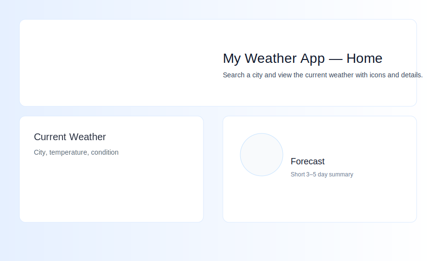
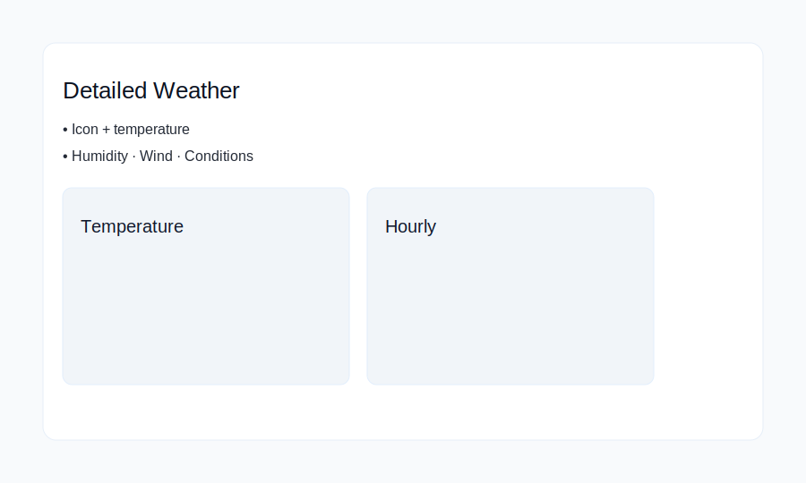
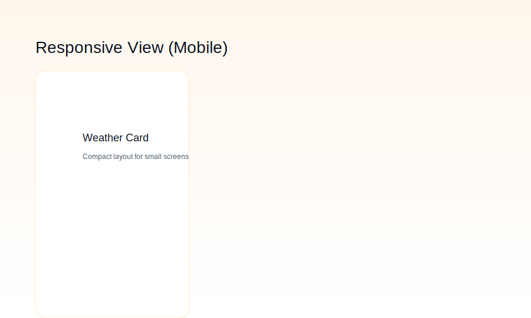

# WeatherSphere 🌤️

A modern, responsive weather application built with React + Vite. Features real-time weather data, an intuitive UI, and a seamless user experience.

---

✨ Features

- 🔍 City Search — Find weather for any city worldwide
- 📱 Fully Responsive — Optimized for desktop, tablet, and mobile
- 🎨 Modern UI — Clean, professional design with smooth animations
- ⚡ Fast Performance — Built with Vite for optimal loading speeds
- 🌡️ Detailed Metrics — Temperature, humidity, wind speed, and conditions
- 🖼️ Dynamic Icons — Real weather icons from OpenWeatherMap
- 🛡️ Error Handling — Graceful error states and loading indicators

---

## Quick start

Prerequisites

- Node.js 16+
- OpenWeatherMap API key

Installation

1. Clone the repository and change to the project folder:

```bash
git clone <repo-url>
cd my-weather-app
```

2. Install dependencies:

```bash
npm install
```

3. Configure environment variables

Create a `.env` file in the project root (or copy the example if provided):

```bash
# If an example exists
cp .env.example .env || true

# Then edit `.env` and add your key
# .env
VITE_API_KEY=your_actual_api_key_here
```

4. Start the development server:

```bash
npm run dev
```

Open http://localhost:5173 to view the app.

---

## Application Preview

Main features (centered gallery):

<div align="center">
  <!-- Row 1 -->
  
  
  
</div>

Additional screenshots:

<div align="center" style="display:flex;flex-wrap:wrap;gap:10px;justify-content:center;">
  
  
  
</div>

---

## Build & Deployment

Development

```bash
npm run dev
```

Production build

```bash
npm run build
```

Preview production

```bash
npm run preview
```

Lint

```bash
npm run lint
```

---

## Project Architecture

```
src/
├── components/          # Reusable UI components
│   ├── SearchInput/     # City search functionality
│   └── WeatherDisplay/  # Weather data presentation
├── pages/
│   └── home/            # Main application page
├── hooks/               # (optional) Custom React hooks
├── utils/               # Helper functions and utilities
├── styles/              # Global styles and CSS
└── App.jsx              # Application root
```

Key components

- **Home** — Main container managing application state and fetching data
- **SearchInput** — Handles city search with validation and submit
- **WeatherDisplay** — Presents weather data with icons and responsive layout
- **Custom hooks** — (optional) for API calls or reusable logic

---

## Configuration & API Integration

Environment variables

- `VITE_API_KEY` — OpenWeatherMap API key (required)

API usage example

```javascript
// Example API call
const API_URL = `https://api.openweathermap.org/data/2.5/weather?q=${city}&units=metric&appid=${apiKey}`;
```

---

## UI/UX Features

- Responsive grid layout adapting to all screen sizes
- Loading skeletons / spinner while fetching data
- Graceful error messages for invalid city or network issues
- Color-coded / accessible metrics and smooth CSS transitions

---

## Future enhancements

- 5-day weather forecast
- Geolocation-based default city
- Temperature unit toggle (Celsius/Fahrenheit)
- Weather maps & PWA support
- Dark / light theme toggle

---

## Contributing

Contributions welcome:

1. Fork the repo
2. Create a feature branch: `git checkout -b feature/your-feature`
3. Commit your changes: `git commit -m "Add feature"`
4. Push and open a PR

---

## License

This project is licensed under the MIT License. See the `LICENSE` file for details.

---

## Security notes

- Never commit API keys to source control
- Use environment variables for sensitive data
- Consider a backend proxy for production deployments

---

Built with ❤️ using React + Vite. Weather icons by OpenWeatherMap.

# My Weather App

> A simple, responsive weather forecast single-page app built with React + Vite. It demonstrates fetching current weather data from OpenWeatherMap, basic state management with hooks, conditional rendering, and a clean, mobile-friendly UI using plain CSS.

---

## Highlights

- React (Vite) single-page app
- City search and default city view (London)
- Current weather display: city, temperature, condition, humidity, wind
- Weather icons (OpenWeatherMap icon set)
- Loading and error states
- Responsive, plain-CSS UI (no UI libraries)

---

## Screenshots

Gallery: the images below show the app on desktop, the detailed weather view, and mobile/responsive variations. The first three are SVG placeholders; the others are example PNGs included in `public/image/`. Replace them with real screenshots if you prefer.

<!-- Row 1 -->


<!-- Row 2 -->


---

## Quick start

1. Clone the repo and change into the project folder:

```bash
git clone <repo-url>
cd my-weather-app
```

2. Install dependencies:

```bash
npm install
```

3. Create a `.env` file in the project root with your OpenWeatherMap API key:

```env
# .env
VITE_API_KEY=your_openweathermap_api_key_here
```

Note: Vite exposes env variables prefixed with `VITE_` to client code. This project expects `VITE_API_KEY`.

4. Start the dev server:

```bash
npm run dev
```

Open the URL printed by Vite (usually http://localhost:5173).

---

## Build & Preview

Build for production:

```bash
npm run build
```

Preview the production build locally:

```bash
npm run preview
```

---

## How it works (brief)

- The main UI is implemented in `src/pages/home/index.jsx`. That file manages the primary state (city, weather data, loading, error) using `useState` and performs data fetching in `useEffect`.
- The app uses the OpenWeatherMap Current Weather endpoint to fetch live data. The response is passed down to presentational components that render the UI.
- Weather icons are displayed using OpenWeatherMap's free icon URLs, e.g.:

```jsx

```

---

## Project structure (relevant files)

- `src/App.jsx` — App root that renders the `Home` page.
- `src/pages/home/index.jsx` — Main page: search, fetch, and coordinate UI.
- `src/components/SearchInput.jsx` — Search form (input + button).
- `src/components/WeatherDisplay.jsx` — Presentational component showing current weather and icon.
- `src/App.css` — Styles for layout, card UI, and responsive rules.

---

## Environment variables

- `VITE_API_KEY` — Your OpenWeatherMap API key. Add it to `.env` in the project root.

Security note: for learning/demo apps it's acceptable to use a client-side key, but do not commit secret keys to public repositories. For production, proxy requests through a backend.

---

## Where to go next (suggestions)

- Add a short-term forecast (3–5 days) using OpenWeatherMap's `/forecast` endpoint and display daily icons.
- Improve accessibility (ARIA labels, keyboard focus states, color-contrast checks).
- Add unit tests for helper functions or simple component smoke tests.
- Add CI for linting/build checks and an automated deploy step.

---

## License

This project is provided as-is for learning purposes. Add a license if you plan to publish or share widely (e.g., `MIT`).

---

If you'd like, I can also:

- Add a short demo GIF or screenshot to the README.
- Expand the forecast feature and show an example of the forecast card design.

Happy coding!

# React + Vite

This template provides a minimal setup to get React working in Vite with HMR and some ESLint rules.

Currently, two official plugins are available:

- [@vitejs/plugin-react](https://github.com/vitejs/vite-plugin-react/blob/main/packages/plugin-react) uses [Babel](https://babeljs.io/) (or [oxc](https://oxc.rs) when used in [rolldown-vite](https://vite.dev/guide/rolldown)) for Fast Refresh
- [@vitejs/plugin-react-swc](https://github.com/vitejs/vite-plugin-react/blob/main/packages/plugin-react-swc) uses [SWC](https://swc.rs/) for Fast Refresh

## React Compiler

The React Compiler is not enabled on this template because of its impact on dev & build performances. To add it, see [this documentation](https://react.dev/learn/react-compiler/installation).

## Expanding the ESLint configuration

If you are developing a production application, we recommend using TypeScript with type-aware lint rules enabled. Check out the [TS template](https://github.com/vitejs/vite/tree/main/packages/create-vite/template-react-ts) for information on how to integrate TypeScript and [`typescript-eslint`](https://typescript-eslint.io) in your project.
